# VIMA-Bench: Benchmark for Multimodal Robot Learning
<div align="center">

[[Website]](https://vimalabs.github.io/)
[[arXiv]](https://arxiv.org/abs/2210.03094)
[[PDF]](https://vimalabs.github.io/assets/vima_paper.pdf)
[[Pretrained Models]](https://github.com/vimalabs/VIMA#pretrained-models)
[[Model Code]](https://github.com/vimalabs/VIMA)
[[Training Data]](https://huggingface.co/datasets/VIMA/VIMA-Data)
[[Datasheet]](datasheet.md)

[](https://github.com/vimalabs/VIMA)
[](https://github.com/vimalabs/VimaBench/blob/main/LICENSE)
______________________________________________________________________
</div>


VIMA-Bench is a newly introduced task suite and benchmark for learning general robot manipulation with multimodal prompts. It features 17 representative meta-tasks with multimodal prompt templates, which can be procedurally instantiated into thousands of individual tasks by various combinations of textures and tabletop objects. It also establishes a 4-level protocol to evaluate progressively stronger generalization capabilities, from randomized object placement to novel tasks altogether. Finally, it provides a massive imitation dataset with 650K successful trajectories and multimodal prompts to learn general robot manipulation.

# Installation
VIMA-Bench requires Python ≥ 3.9. We have tested on Ubuntu 20.04 and Mac OS X. Installing VIMA-Bench is as simple as:

```bash
git clone https://github.com/vimalabs/VimaBench && cd VimaBench
pip install -e .
```

# Getting Started
VIMA-Bench provides a [Gym-style](https://www.gymlibrary.ml/) interface for developing robot agents conditioned on multimodal prompts that interact with the simulator in a loop. Here is a very simple code snippet to instantiate the task "Visual Manipulation" and query the corresponding prompt:

```python
from vima_bench import make

env = make(task_name="visual_manipulation")

obs = env.reset()
prompt, prompt_assets = env.prompt, env.prompt_assets
```

# Task Suite
VIMA-Bench features 17 representative meta-tasks with multimodal prompt templates, which can be procedurally instantiated into thousands of individual tasks by various combinations of textures and tabletop objects.

| Task Name                                         | How to Create                             | Demonstration                                     |
|---------------------------------------------------|-------------------------------------------|---------------------------------------------------|
| Simple Object Manipulation: Visual Manipulation   | `make("visual_manipulation", ...)`        | 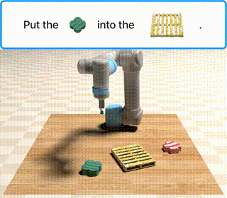 |
| Simple Object Manipulation: Scene Understanding   | `make("scene_understanding", ...)`        | 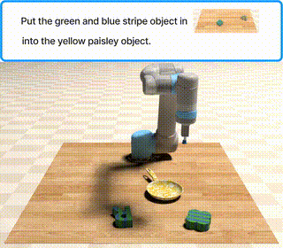 |
| Simple Object Manipulation: Rotate                | `make("rotate", ...)`                     | 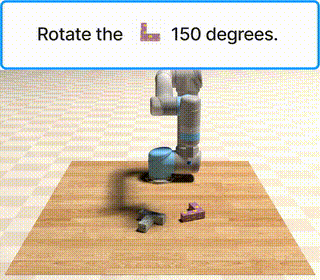              |
| Visual Goal Reaching: Rearrange                   | `make("rearrange", ...)`                  | 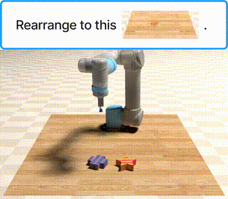                    |
| Visual Goal Reaching: Rearrange then Restore      | `make("rearrange_then_restore", ...)`     | 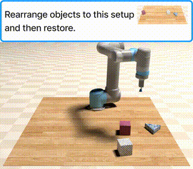                    |
| Novel Concept Grounding: Novel Adjective          | `make("novel_adj", ...)`                  | 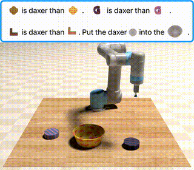                    |
| Novel Concept Grounding: Novel Noun               | `make("novel_noun", ...)`                 | 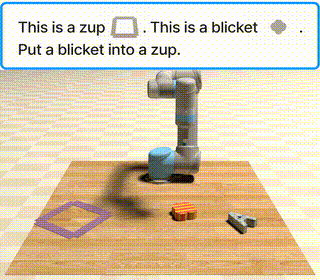                    |
| Novel Concept Grounding: Novel Adjective and Noun | `make("novel_adj_and_noun", ...)`         | 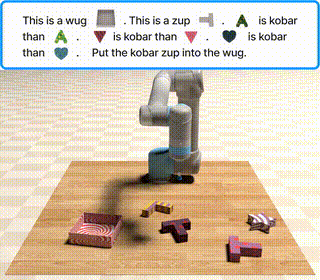                    |
| Novel Concept Grounding: Twist                    | `make("twist", ...)`                      |                     |
| One-shot Video Imitation: Follow Motion           | `make("follow_motion", ...)`              | 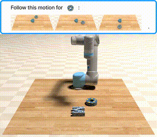                    |
| One-shot Video Imitation: Follow Order            | `make("follow_order", ...)`               | 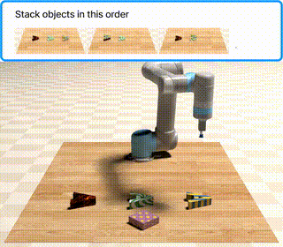                    |
| Visual Constraint Satisfaction: Without Exceeding | `make("sweep_without_exceeding", ...)`    | 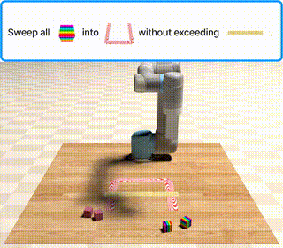                    |
| Visual Constraint Satisfaction: Without Touching  | `make("sweep_without_touching", ...)`     | 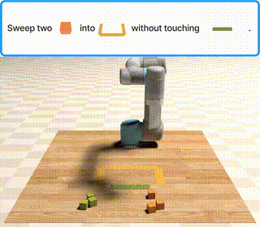                    |
| Visual Reasoning: Same Texture                    | `make("same_texture", ...)`               | 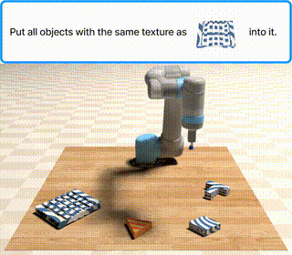                    |
| Visual Reasoning: Same Shape                      | `make("same_shape", ...)`                 | 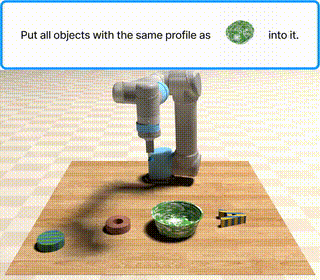                    |
| Visual Reasoning: Manipulate Old Neighbor         | `make("manipulate_old_neighbor", ...)`    | 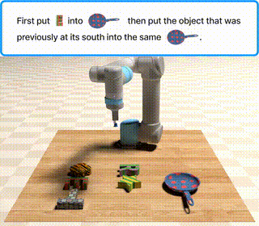                    |
| Visual Reasoning: Pick in Order then Restore      | `make("pick_in_order_then_restore", ...)` | 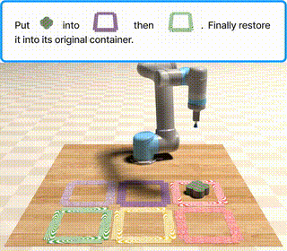                    |

# Evaluation Benchmark
VIMA-Bench establishes a 4-level protocol to evaluate progressively stronger generalization capabilities, from randomized object placement to novel tasks altogether. Concretely, we partition the entire task suite into 4 groups:

```python
from vima_bench import ALL_PARTITIONS
print(ALL_PARTITIONS)

>>> ['placement_generalization', 'combinatorial_generalization', 'novel_object_generalization', 'novel_task_generalization']
```

To instantiate a task with configs from a certain evaluation level (partition), run
```python
from vima_bench import make, PARTITION_TO_SPECS

env = make(task, task_kwargs=PARTITION_TO_SPECS["test"][partition][task])
```

Note that different evaluation level (partition) has different tasks. See our [paper]() for detailed information.

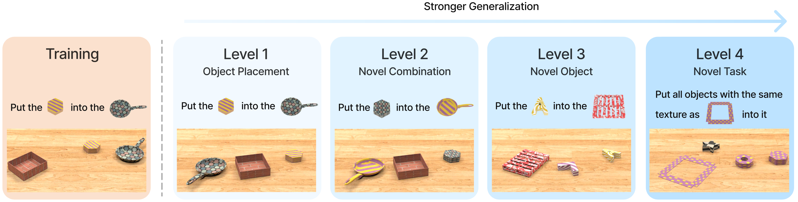

## Create Benchmarking Environments
To create benchmarking environment instances used in our paper, let's say we want to evaluate on task `task_name` under the level `partition` with seed `seed`, we can simply run
```python
env = make(
    task_name,
    modalities=["rgb", "segm"],
    task_kwargs=PARTITION_TO_SPECS["test"][partition][task_name] or {},
    seed=seed
)
```

Note that by default we set `hide_arm_rgb = True` to avoid any occlusions caused by the robot arm.

# Observation and Action Space
By default, VIMA-Bench's observation space includes RGB images, segmentation, and an indicator specifying the type of end effector (suction cup or spatula). RGB and segmentation are spatially aligned and are from two views (frontal and top).

```python
env.observation_space

>>> {
    "rgb": {
        "front": Box(0, 255, shape=(3, h, w), dtype=np.uint8),
        "top": Box(0, 255, shape=(3, h, w), dtype=np.uint8),
    },
    
    "segm": {
        "front": Box(0, 255, shape=(h, w), dtype=np.uint8),
        "top": Box(0, 255, shape=(h, w), dtype=np.uint8),        
    },
    
    "ee": Discrete(2),
}
```

VIMA-Bench's action space includes pick pose and place pose. Each pose consists of a 2D coordinate and a rotation represented as quaternion.

```python
import numpy as np

env.action_space

>>> {
    "pose0_position": Box(low=[0.25, -0.5], high=[0.75, 0.50], shape=(2,), dtype=np.float32),
    "pose0_rotation": Box(low=-1, high=1, shape=(4,), dtype=np.float32),
    "pose1_position": Box(low=[0.25, -0.5], high=[0.75, 0.50], shape=(2,), dtype=np.float32),
    "pose1_rotation": Box(low=-1, high=1, shape=(4,), dtype=np.float32),
}
```

# Oracle
We provide built-in oracles that can solve all tasks by accessing privileged state information.

To visualize oracle demonstrations, run

```bash
python3 scripts/oracle/run.py task={task_to_run}
```

These oracles can also be used to generate expert data for behavior learning. To generate data, run

```bash
python3 scripts/data_generation/run.py num_episodes_per_task={num_trajs_to_generate_per_task} save_path={save_path}
```

# Training Data
We also release an offline dataset with 650K trajectories conditioned on multimodal prompts to learn general robot manipulation. Our dataset is hosted on [🤗Hugging Face](https://huggingface.co/datasets/VIMA/VIMA-Data).

After download and unzip, data are grouped into different tasks. Within each trajectory's folder, there are two folders `rgb_front` and `rgb_top`, and three files `obs.pkl`, `action.pkl`, and `trajectory.pkl`. RGB frames from a certain perspective are separately stored in corresponding folder. `obs.pkl` includes segmentation and state of end effector. `action.pkl` contains oracle actions. `trajectory.pkl` contains meta information such as elapsed steps, task information, and object information. Users can build their custom data piepline starting from here.

To run an example script to load a single trajectory:

```bash
python3 scripts/data_loading.py --path={path_to_a_single_trajectory}
```

# Check out our paper! 

Our paper is posted on [arXiv](https://arxiv.org/abs/2210.03094). If you find our work useful, please consider citing us! 

```bibtex
@article{jiang2022vima,
  title   = {VIMA: General Robot Manipulation with Multimodal Prompts},
  author  = {Yunfan Jiang and Agrim Gupta and Zichen Zhang and Guanzhi Wang and Yongqiang Dou and Yanjun Chen and Li Fei-Fei and Anima Anandkumar and Yuke Zhu and Linxi Fan},
  year    = {2022},
  journal = {arXiv preprint arXiv: Arxiv-2210.03094}
}
```

# License
| Component            | License                                                                                                                             |
|----------------------|-------------------------------------------------------------------------------------------------------------------------------------|
| Codebase (this repo) | [MIT License](LICENSE)                                                                                                                      |
| Dataset              | [Creative Commons Attribution 4.0 International (CC BY 4.0)](https://creativecommons.org/licenses/by/4.0/legalcode)                 |
